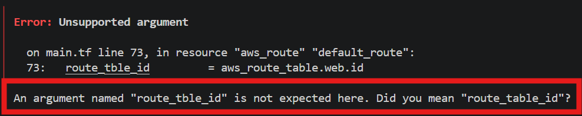
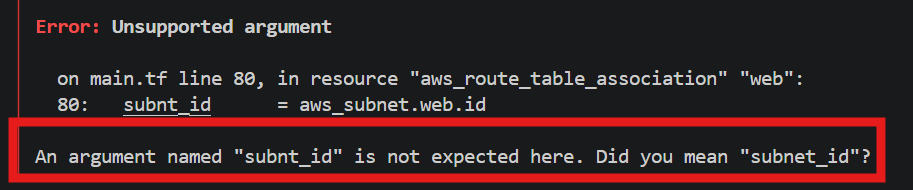
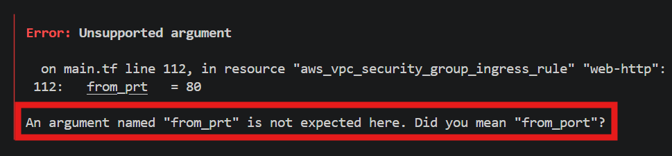
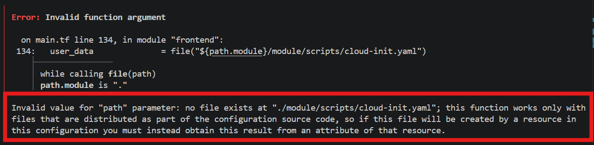
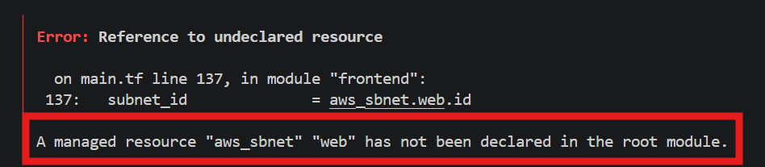
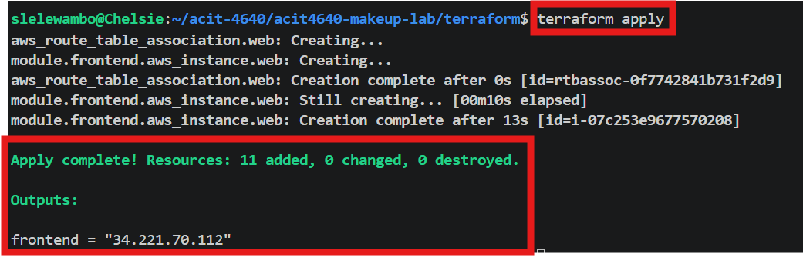

# acit4640-makeup-lab
# acit4640-makeup-lab
# commands

- `ssh-keygen -t ed25519 -f ~/.ssh/lab14 -C "aws lab-14"`
- `terraform init`
- `terraform plan`
- `terraform apply`

## Errors and fixes

1. "Missing required" argument & "unsupported argument" - *route_table* *( 2 errors)*

>Fix: changed the spelling from "route_tble_id" to "route_table_id (line 73)"

3. "Unsupported argument" - subnt_id

>fix: changed the spelling from "subnt_id" to "subnet_id" (line 80)

4. "Unsupported argument" - from_prt

>fix: changed the spelling from "from_prt" to "from_port" (line 80)

5. Invalid function argument 

>fix: changed the 'user_data' value from 'file("${path.module}/modules/scripts/cloud-init.yaml")' to 'file("${path.module}/scripts/cloud-init.yaml")'

6. Reference to undeclared resource

>fix: changed spelling in 'subnet_id' value from "aws_sbnet.web.id" to "aws_subnet.web.id"

## `terraform apply` working
